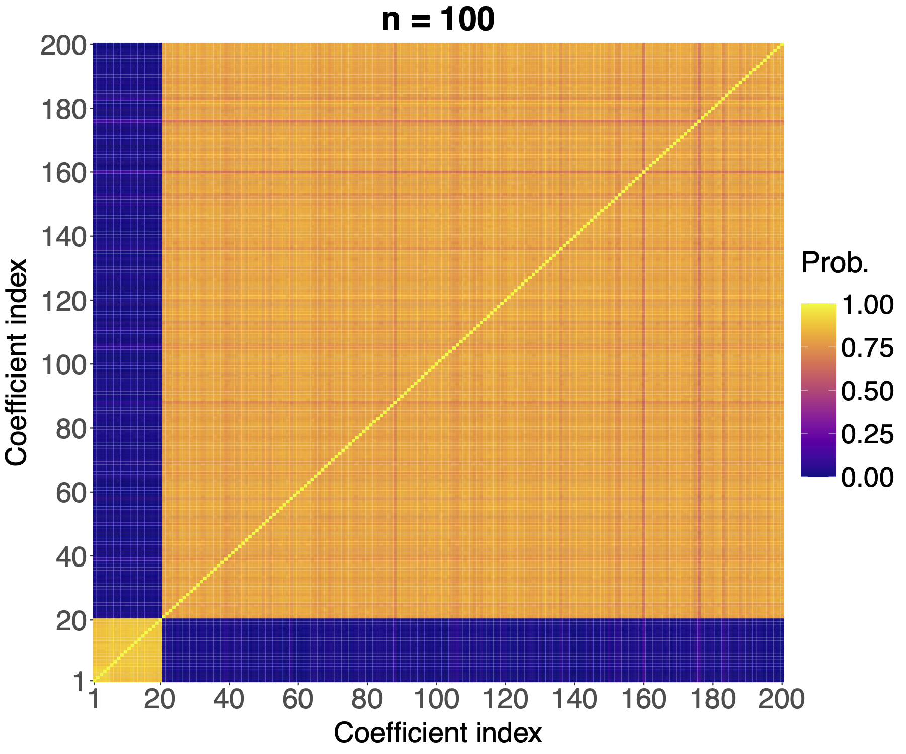
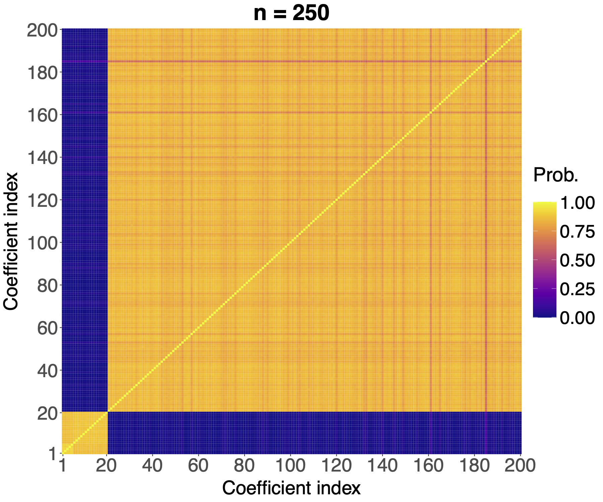
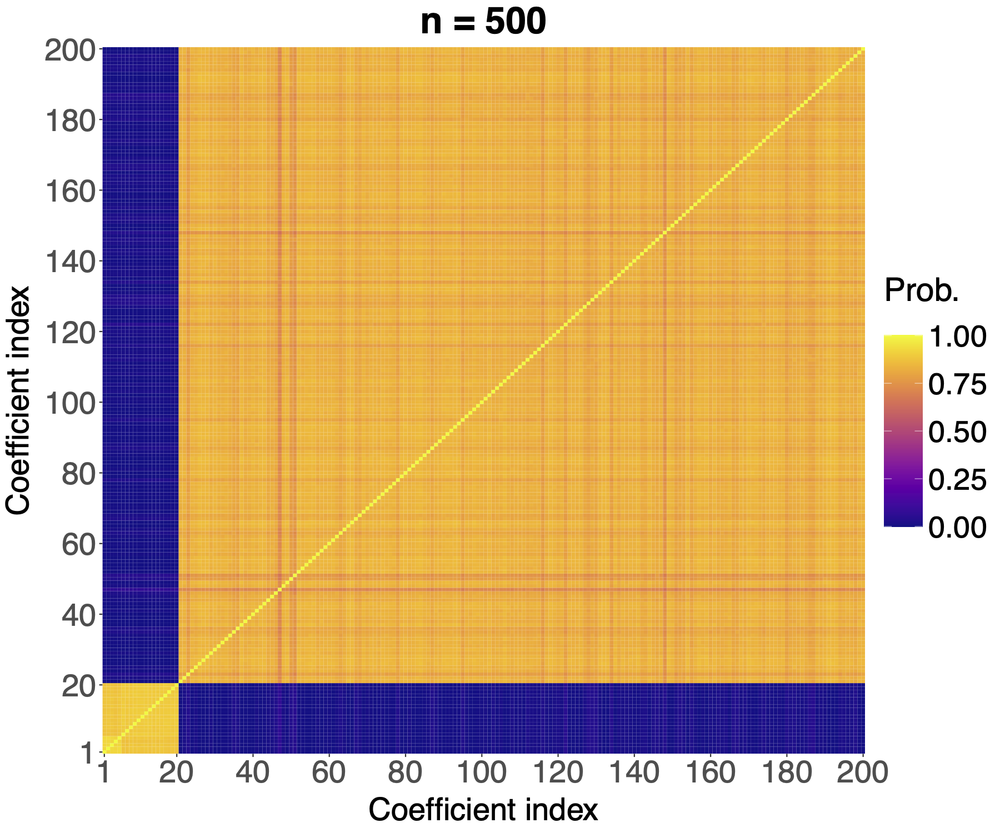

# bnplasso-examples

Thanks for dropping by! This repository contains source code to reproduce the results from the article "[Adaptive Shrinkage with a Nonparametric Bayesian Lasso](https://doi.org/10.1080/10618600.2025.2572327)" (Marin et al., 2026).

  

## Getting started 

The `bnplasso` R package is available at the Github repository: [https://github.com/marinsantiago/bnplasso](https://github.com/marinsantiago/bnplasso).

If you would like to reproduce the results from Marin et al. (2026), you should install the 
version of the  package employed at that time (`bnplasso 0.1.0`). 
That can easily be done by running in R:

``` r
# install.packages("pak")
pak::pak("marinsantiago/bnplasso@3c87169")
```

Alternatively, you can also install the package (`bnplasso 0.1.0`) from the
`bnplasso` folder in the supplementary materials to Marin et al. (2026):

  1. In R, set your working directory to the folder `bnplasso`.
  
  2. Run the following R code:
  
``` r
# install.packages("devtools")
devtools::build()
devtools::install()
```

A detailed *changelog* is available [here](https://marinsantiago.github.io/bnplasso-site/news/index.html).

## Folder structure 

```
.
├── data-analyses/                 # Scripts to reproduce the results from the real-world data analysis, as well as the actual raw data files
   └── protein/                    # Analysis of the protein activity data
├── imgs/                          # Illustrative plots used in the README file
├── R/                             # Scripts with helper functions required throughout the analysis
└── sims/                          # Scripts to reproduce the results from the simulation studies
   ├── asymptotic_lambdas/         # Asymptotic behavior of λ_1 and λ_2
   ├── co_clustering/              # Co-cluster analysis
   ├── n100_rho03/                 # Simulation setting with n = 100 and ρ = 0.3
   ├── n100_rho05/                 # Simulation setting with n = 100 and ρ = 0.5
   ├── n100_rho07/                 # Simulation setting with n = 100 and ρ = 0.7
   ├── n100_rho03_var5/            # Simulation setting with n = 100, ρ = 0.3, and σ^2 = 5
   ├── n250_rho03/                 # Simulation setting with n = 250 and ρ = 0.3
   ├── n250_rho05/                 # Simulation setting with n = 250 and ρ = 0.5
   ├── n250_rho07/                 # Simulation setting with n = 250 and ρ = 0.7
   ├── n250_rho03_var5/            # Simulation setting with n = 250, ρ = 0.3, and σ^2 = 5
   ├── n500_rho03/                 # Simulation setting with n = 500 and ρ = 0.3
   ├── n500_rho05/                 # Simulation setting with n = 500 and ρ = 0.5
   ├── n500_rho07/                 # Simulation setting with n = 500 and ρ = 0.7
   ├── n500_rho03_var5/            # Simulation setting with n = 500, ρ = 0.3, and σ^2 = 5
   ├── results/                    # Stored simulation results
   ├── robustness_clustering/      # Clustering results for different values of α, a, and b
   └── var_select_consistency/     # Asymptotic support recovery analysis
```

## Running the scripts

Detailed instructions on how to reproduce the results from the article are presented in the README file, located in the Supplementary Materials accompanying the main manuscript, available at [https://doi.org/10.1080/10618600.2025.2572327](https://doi.org/10.1080/10618600.2025.2572327).

## <a name="cite"></a> Citation

If you use any part of this code in your work, please consider citing our *JCGS* paper:

```TeX
@article{marin_bnplasso,
  title   = {Adaptive Shrinkage with a Nonparametric {B}ayesian Lasso},
  author  = {Santiago Marin and Bronwyn Loong and Anton H. Westveld},
  journal = {Journal of Computational and Graphical Statistics},
  volume  = {35},
  number  = {2},
  pages   = {854--864},
  year    = {2026},
  doi     = {10.1080/10618600.2025.2572327}
}
```

## Disclaimer

The software is provided "as is," without warranty of any kind, express or implied,
including but not limited to the warranties of merchantability, fitness for a particular
purpose and noninfringement. In no event shall the authors or copyright holders be liable
for any claim, damages, or other liability, whether in an action of contract, 
tort or otherwise, arising from, out of, or in connection with the software or the use
or other dealings in the software.

## <a name="refs"></a> References

Marin, S., Loong, B., and Westveld, A. H. (2026), "Adaptive Shrinkage with a Nonparametric Bayesian Lasso." *Journal of Computational and Graphical Statistics*, **35**(2):854-864. [doi:10.1080/10618600.2025.2572327](https://doi.org/10.1080/10618600.2025.2572327)

</br>
